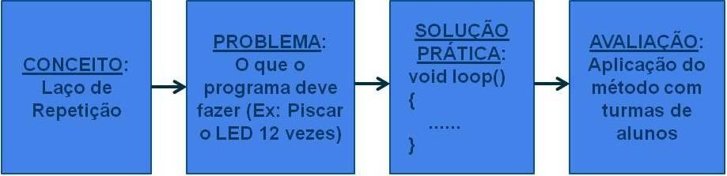

# USO DA ROBÓTICA PARA O ESTUDO DE ALGORITMOS 

## Título
Uso da Robótica para o Estudo de Algoritmos 

## Publicação
[Biblioteca IFC](https://pergamumweb.ifc.edu.br/pergamumweb_ifc/vinculos/000000/000000d1.pdf)
