# USO DA ROBÓTICA PARA O ESTUDO DE ALGORITMOS 

 

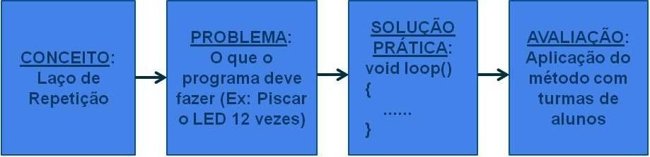

## Título
Uso da Robótica para o Estudo de Algoritmos 

## Publicação TCC
[Biblioteca IFC](https://pergamumweb.ifc.edu.br/pergamumweb_ifc/vinculos/000000/000000d1.pdf)

## Outras Publicações (Artigo Científico)
• Anais
 
[V FICE](http://www.camboriu.ifc.edu.br/vfice2014/anais/trab73.html)

### Objetivo Geral
Criar um modelo para demonstrar a aplicação dos conceitos básicos da disciplina de Algoritmos e Programação de Computadores por meio da criação de projetos com Arduino.

### Objetivos Específicos
a) Proporcionar maior atratividade ao aluno no estudo de algoritmos;
 
b) Aplicar os conceitos vistos em aula em projetos práticos.

### Exemplos de Projetos Práticos com Arduino Aplicados nos Conceitos de Algoritmos 

#### Estruturas de Decisão - Projeto
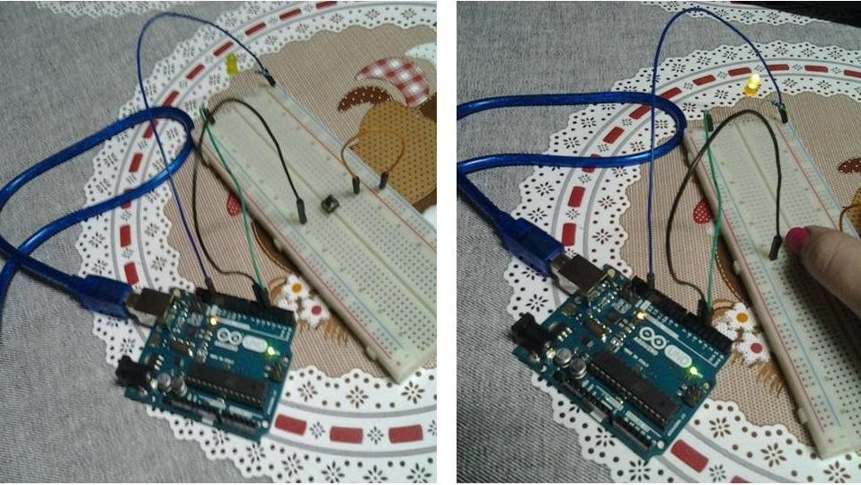

#### Estruturas de Decisão - Montagem
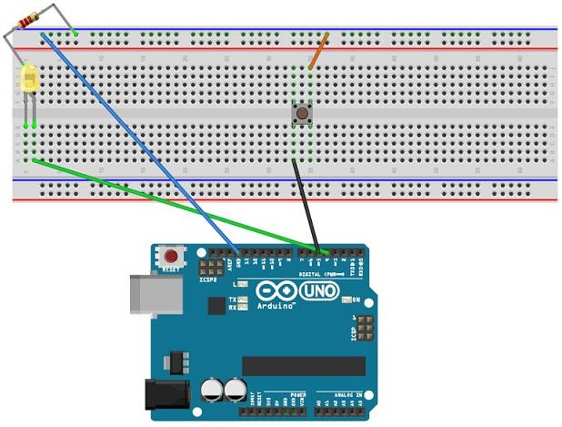

 

#### Estruturas de Repetição - Projeto
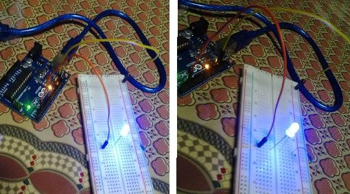

#### Estruturas de Repetição - Montagem
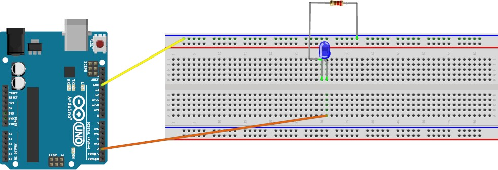

 

#### Vetores - Projeto
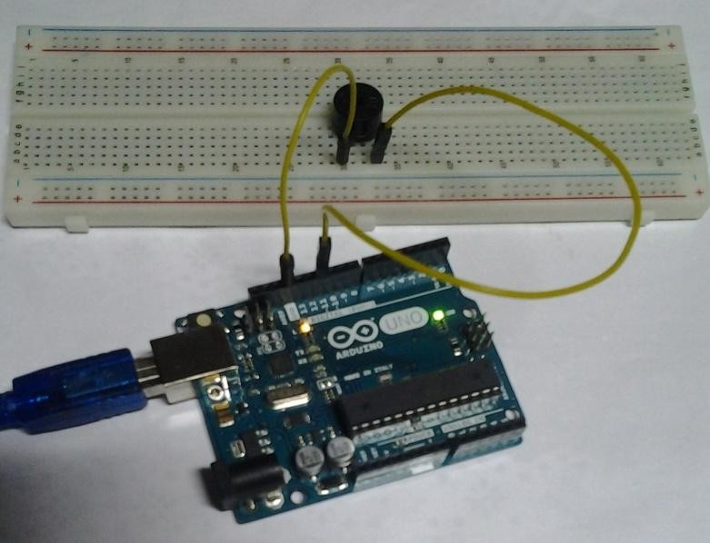

#### Vetores - Montagem
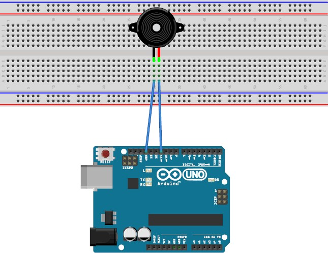

 

#### Matrizes - Projeto
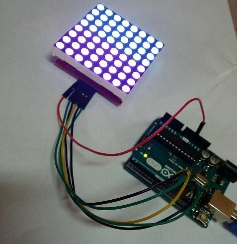

#### Matrizes - Montagem
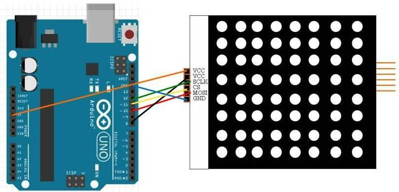

 

### Resultados da Aplicação da Pesquisa com os Alunos de Informática do IFC - Câmpus Camboriú

#### Opiniões dos alunos de nível médio em relação à utilização da robótica em programação de computadores
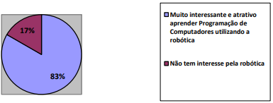

 

#### Área profissional/curso que os alunos de nível médio pretendem seguir 

 

#### Alunos de nível médio que já utilizaram robô 
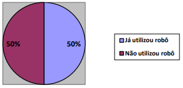

 

#### Alunos de nível superior que já utilizaram robô 
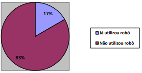

 

#### Motivação do aluno na escolha do curso profissional
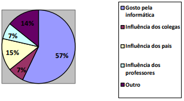
