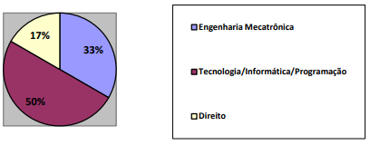

# USO DA ROBÓTICA PARA O ESTUDO DE ALGORITMOS 

 

## Título
Uso da Robótica para o Estudo de Algoritmos 

## Publicação TCC
[Biblioteca IFC](https://pergamumweb.ifc.edu.br/pergamumweb_ifc/vinculos/000000/000000d1.pdf)

## Outras Publicações (Resumo Expandido)
• Anais
 
[V FICE](http://www.camboriu.ifc.edu.br/vfice2014/anais/trab73.html)

### Objetivo Geral
Criar um modelo para demonstrar a aplicação dos conceitos básicos da disciplina de Algoritmos e Programação de Computadores por meio da criação de projetos com Arduino.

### Objetivos Específicos
a) Proporcionar maior atratividade ao aluno no estudo de algoritmos;
 
b) Aplicar os conceitos vistos em aula em projetos práticos.

### Exemplos de Projetos Práticos com Arduino Aplicados nos Conceitos de Algoritmos 

#### Estruturas de Decisão - Projeto

#### Estruturas de Decisão - Montagem

 

#### Estruturas de Repetição - Projeto

#### Estruturas de Repetição - Montagem

 

#### Vetores - Projeto

#### Vetores - Montagem

 

#### Matrizes - Projeto

#### Matrizes - Montagem

 

## Oficina Prática de Arduino Ministrada no IFC - Câmpus Camboriú

### Resultados da Pesquisa Aplicada com os Alunos de Informática no Evento 5º e-TIC

#### Opiniões dos alunos de nível médio em relação à utilização da robótica em programação de computadores

 

#### Área profissional/curso que os alunos de nível médio pretendem seguir 

 

#### Alunos de nível médio que já utilizaram robô 

 

#### Alunos de nível superior que já utilizaram robô 

 

#### Motivação do aluno na escolha do curso profissional

 

## Requisitos
| Requisito       | Versão            |
|---------------- |-------------------|
| Windows         | 7 ou superior     |
| Arduino         | 1.0.5 ou superior |

Existem versões do Arduino para outros Sistemas Operacionais também, porém, este projeto foi testado apenas no Windows. Por este motivo, foi definido como requisito mínimo, ter esse SO (o presente projeto não foi testado nos demais SO's).  

#### Instalação do Software Arduino
• Site Oficial
 
[https://www.arduino.cc/en/software](https://www.arduino.cc/en/software)

 </img>

 

## Referências
ARDUINO. Arduino (Site). 2014. Disponível em: www.arduino.cc. Acesso em: 05 set. 2014.

BARBOSA, L. F. W. A Utilização da Robótica como Ferramenta Multidisciplinar no Ensino da Engenharia Elétrica. In: CBA: Congresso Brasileiro de Automática, n. 17: 2008, Juiz de Fora, MG. Disponível em:
http://www.labplan.ufsc.br/congressos/cba2008/textos/CBA_2008_Artigos/37941.pdf. Acesso em: 09 ago. 2014.

CASTILHO, M.; SILVA, F.; WEINGAERTNER, D. Algoritmos e Estrutura de Dados I. 2011. Disponível em: www.inf.ufpr.br/cursos/ci055/apostila.pdf. Acesso em: 03 set. 2014.

CISCO. Estudo revela demanda crescente por profissionais de tecnologia no Brasil, mas há falta de mão de obra qualificada. 2013. Disponível em:
http://globalnewsroom.cisco.com/pt/br/release/Estudo-revela-demanda-crescente-por-profissionais-de-tecnologia-no-Brasil-mas-h%C3%A1-falta-1688801. Acesso em: 16 mai. 2014.

DETERS, J. I et. al. O Desafio de Trabalhar com Alunos Repetentes na Disciplina de Algoritmos e Programação. Florianópolis: Serviço Nacional de Aprendizagem Industrial – SENAI, 2008; Itajaí: Universidade do Vale do Itajaí – UNIVALI, 2008; São José: Universidade do Vale do Itajaí – UNIVALI, 2008. Disponível em:
http://proativa.virtual.ufc.br/sbie/CD_ROM_COMPLETO/workshops/workshop%202/O%20Desafio%20de%20Trabalhar%20com%20Alunos%20Repetentes%20na.pdf. Acesso em: 21 abr. 2014.

FORBELLONE, A. L. V.; EBERSPÄCHER, H. F. Lógica de programação: a construção de algoritmos e estruturas de dados. 3ª ed. São Paulo: Prentice Hall, 2005.

HINTERHOLZ JR., O. Tepequém: uma nova ferramenta para o ensino de algoritmos nos cursos superiores em computação. Roraima (Boa Vista): Faculdade Atual da Amazônia – FAA, 2009. Disponível em:
http://csbc2009.inf.ufrgs.br/anais/pdf/wei/st02_04.pdf. Acesso em: 21 abr. 2014.

ITAJAI. Escola de Itajaí recebe Oficina de Robótica. 2014. Disponível em:
http://www.itajai.sc.gov.br/noticia/8807/escola-de-itajai-recebe-oficina-de-robotica#.VFa1OvnF8R4. Acesso em: 03 ago. 2014.

MANZANO, J. A. N. G.; OLIVEIRA, J. F. de. Algoritmos: lógica para desenvolvimento de programação de computadores. 24ª ed. rev. São Paulo: Érica, 2010.

MARJI, M. Aprenda a programar com scratch: uma introdução visual à programação com jogos, arte, ciência e matemática. 1ª ed. São Paulo: Novatec, 2014.

MCROBERTS, M. Arduino básico. Tradução: Rafael Zanolli. São Paulo: Novatec Editora, 2011.

MONK, S. Programação com Arduino: começando com Sketches. Tradução: Anatólio Laschuk. Porto Alegre: Bookman, 2013. 148 p.

MULTILOGICASHOP. Fritzing, um programa livre para projetos e testes com Arduino. Disponível em: http://multilogica-shop.com/content/fritzing-um-programa-livre-para-projetos-e-testes-com-arduino. Acesso em: 02 out. 2014.

NETO, W. C. B. Ferramenta computacional de apoio ao processo de ensino- aprendizagem dos fundamentos de programação de computadores. 2007.
Disponível em: http://www.lbd.dcc.ufmg.br/colecoes/sbie/2007/0022.pdf. Acesso em: 02 out. 2014.

ONACIONAL. 1ª Olimpíada de Robótica Educativa Livre da UPF está com inscrições abertas. 2013. Disponível em:
http://www.onacional.com.br/geral/cidade/44004/1+0limpiada+de+robotica+educativa+livre+da+upf+esta+com+inscricoes+abertas. Acesso em: 03 ago. 2014.

PIVA JR., D.; FREITAS, R. L. Estratégias para melhorar os processos de Abstração na disciplina de Algoritmos. 2011. Disponível em:
http://www.dimap.ufrn.br/csbc2011/anais/eventos/contents/WEI/Wei_Secao_1_Artigo_1_Piva_Jr.pdf. Acesso em: 15 mai. 2014.

PRIETCH, S. S.; PAZETO, T. A. Estudo sobre a Evasão em um Curso de Licenciatura em Informática e Considerações para Melhorias. 2010. Disponível em: http://www.cesmac.com.br/erbase2010/papers/weibase/65258.pdf. Acesso em: 15 mai. 2014.

RIBEIRO, P. C.; MARTINS, C. B.; BERNARDINI, F. C. A Utilização da Robótica
no Ensino de Disciplinas de Programação em Cursos de Computação e Engenharia. In: ENINED: Encontro Nacional de Informática e Educação, n. 2: 2011, Cascavel, PR. Disponível em: http://200.201.81.50/enined/anais/artigos_enined/A35.pdf. Acesso em: 09 ago. 2014.

ROMÃO, L. M.; SACCHELLI, C. M. Uma Proposta Construtivista na Aprendizagem dos Conceitos da Física com o Auxílio da Robótica Educacional. In: SEMINFO: Seminário de Informática, n. 8: 2009, Torres, RS. Disponível em: http://www.seminfo.com.br/anais/2009/pdfs/WEI_Tche/63217_1.pdf. Acesso em: 09 ago. 2014.

SILVA, A. C.; LUCHE, F. D.; GOULART, E.; AGUIAR, V. P. Aplicação da Robótica no Ensino Fundamental: um estudo de caso. Revista de Informática Aplicada, São Caetano do Sul, SP, v.5, n.2, p.1-18, 01 nov. 2009. Bimestral. Disponível em: http://seer.uscs.edu.br/index.php/revista_informatica_aplicada/article/view/991/805. Acesso em: 07 jun. 2014.

SOBJAK, R. Algoritmos e lógica da programação. 2011. Disponível em: <a href=sobjak.files.wordpress.com/2011/07/apostila-de-algoritmos-e-lc3b3gica-da-programac3a7c3a3o.pdf>sobjak.files.wordpress.com/2011/07/apostila-de-algoritmos-e-lc3b3gica-da-programac3a7c3a3o.pdf</a>. Acesso em: 03 set. 2014.

SUPERGEEKS. SuperGeeks (Site). Disponível em: http://supergeeks.com.br. Acesso em: 19 abr. 2014.

UFMS. DESTACOM: tutorial de alice. 2013. Disponível em: http://destacom.ufms.br/wiki/Tutorial_de_Alice#Introdu.C3.A7.C3.A3o. Acesso em: 20 ago. 2014.

WERNER, H.; GASPAR JR., G. P. Utilização de um carro-robô construído com componentes de baixo custo como ferramenta de apoio ao aprendizado dos conceitos de orientação a objetos. 2001. Disponível em: http://lsm.dei.uc.pt/ribie/docfiles/txt200373118616paper-201.pdf. Acesso em: 05 mai. 2014.
